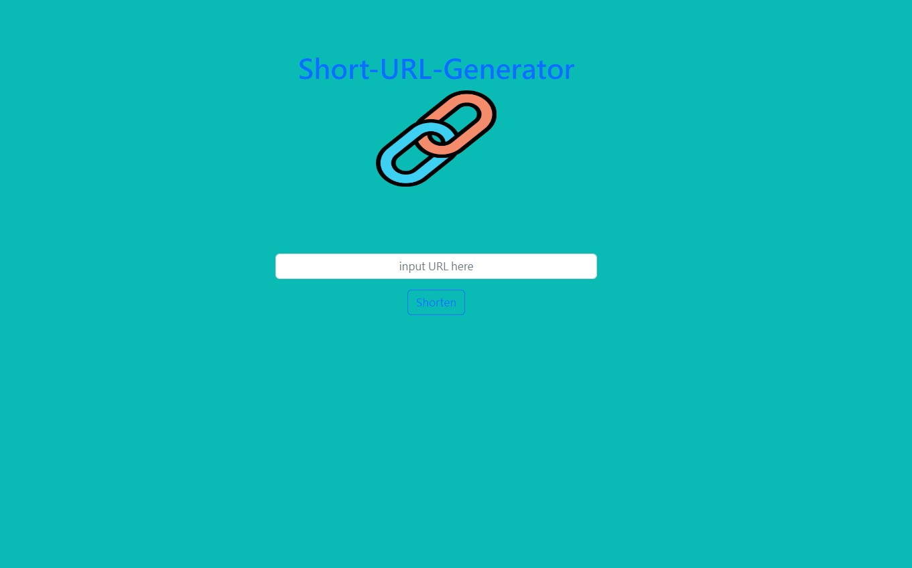
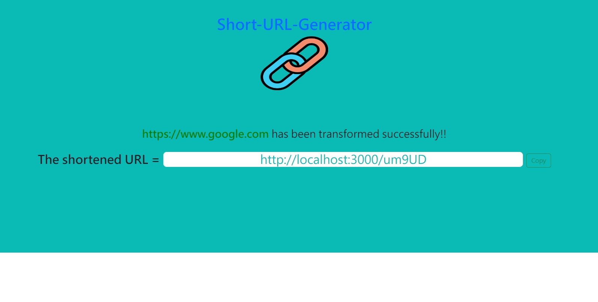

# Short-URL-Generator 短網址產生器



## 介紹

原先的網址有夠長有夠複雜而不滿意嗎? 
Short-URL-Generator 短網址產生器幫你畫繁為簡!

### 功能

- 輸入網址轉換成短網址



- 若輸入的網址有誤則跳出提示
- 點擊Copy按鈕一鍵複製短網址
- 透過短網址能夠轉址到原網址


## 開始使用

1. 請先確認有安裝 node.js 與 npm
2. 將專案 clone 到本地
3. 在本地開啟之後，透過終端機進入資料夾，輸入：

   ```bash
   npm install
   ```

4. 安裝完畢後，繼續輸入：

   ```bash
   npm run start
   ```

5. 若看見此行訊息則代表順利運行，打開瀏覽器進入到以下網址

   ```bash
   Listening on http://localhost:3000
   ```

6. 若欲暫停使用

   ```bash
   ctrl + c
   ```

## 開發工具

- Node.js 14.16.0
- Express 4.17.1
- Express-Handlebars 4.0.2
- Bootstrap 5.2.2
- MongoDB
- mongoose 5.9.7
